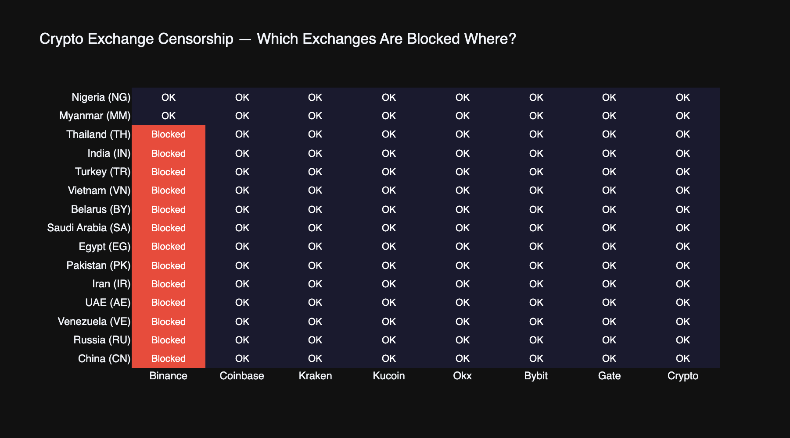
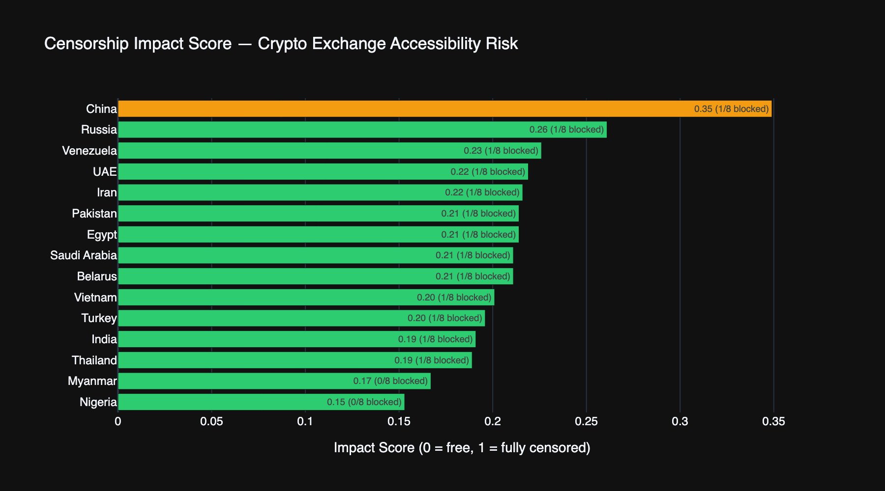
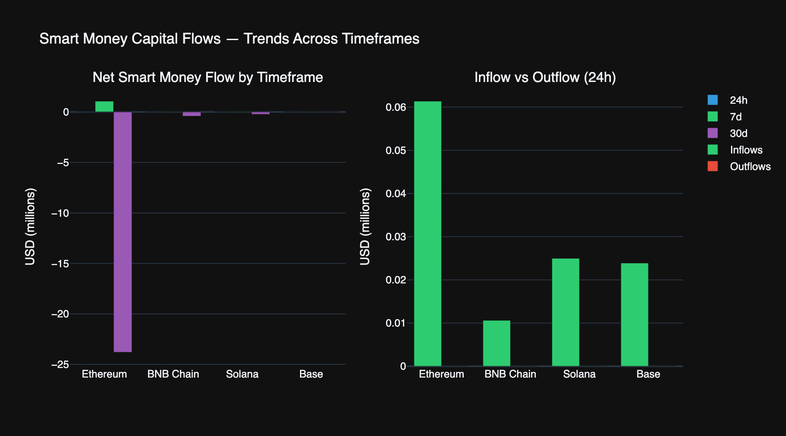
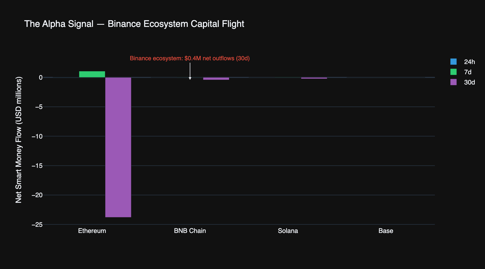
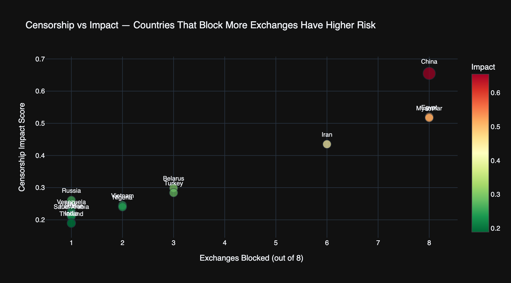

# Censorship Alpha

**When countries block crypto exchanges, where does the money go?**

Correlates real-time internet censorship data from [Voidly](https://voidly.ai) with on-chain blockchain fund flows from [Nansen](https://nansen.ai) to reveal how smart money adapts when authoritarian governments block crypto exchanges.

Built for the [Nansen CLI Challenge](https://nansen.ai) #NansenCLI



## What It Does

Runs a single command that:

1. Checks which crypto exchanges are blocked in 15 countries using Voidly's real-time censorship API
2. Pulls smart money flows, DEX activity, and exchange wallet data from 4 blockchains using the Nansen CLI
3. Computes a **Censorship Impact Score** per country
4. Surfaces privacy/VPN tokens and Polymarket prediction events relevant to crypto censorship
5. Generates an interactive HTML report with 5 charts + PNG exports for social media + JSON data export

## Quick Start

```bash
# Prerequisites: Python 3.9+, Node.js 18+
pip install -r requirements.txt
npm i -g nansen-cli
nansen login --api-key YOUR_KEY

# Generate the full report
python3 censorship_alpha.py --png --json

# Open the report
open output/report.html
```

## Sample Output

### Impact Ranking


### Smart Money Flows (24h / 7d / 30d)


### BNB Ecosystem Capital Flight


### Exchange Blocks vs Censorship Severity


## What Gets Checked

**Exchanges monitored (8):** Binance, Coinbase, Kraken, KuCoin, OKX, Bybit, Gate.io, Crypto.com

**Countries analyzed (15):** Iran, China, Russia, Turkey, Nigeria, Pakistan, Egypt, Vietnam, India, Saudi Arabia, UAE, Thailand, Myanmar, Belarus, Venezuela

**Chains analyzed (4):** Ethereum, BNB Chain, Solana, Base

## Data Sources

| Source | What | API Calls |
|--------|------|-----------|
| [Voidly](https://voidly.ai) | Exchange accessibility, risk tiers, ISP blocking, 7-day forecasts | 6+ |
| [Nansen CLI](https://github.com/nansen-ai/nansen-cli) | Smart money flows, DEX trades, token screener, wallet balances, prediction markets, token search | 14 |
| [Chainalysis](https://www.chainalysis.com/blog/crypto-sanctions-2026/) | Ground-truth exchange blocking data | — |
| [CoinGecko](https://www.coingecko.com/learn/countries-ban-bitcoin) | Country-level crypto bans | — |

**Total: 20+ API calls per report**

## Censorship Impact Score

Each country gets a composite score (0-1) based on:

| Factor | Weight | Source |
|--------|--------|--------|
| Exchange block count (out of 8) | 35% | Voidly + ground-truth |
| Country risk tier (1-5) | 25% | Voidly |
| Censorship severity score | 25% | Voidly (OONI + CensoredPlanet) |
| 7-day forecast risk | 15% | Voidly |

## Report Sections

1. **Exchange Censorship Heat Map** — Which exchanges are blocked where (8 exchanges x 15 countries)
2. **Smart Money Flows** — Net flows across 24h/7d/30d on 4 chains
3. **Censorship Impact Ranking** — Countries ranked by composite score
4. **Exchange Blocks vs Censorship** — Scatter: blocks vs independent severity score
5. **The Alpha Signal** — BNB ecosystem capital flight (Binance = most-blocked exchange)
6. **Top Movers** — Tokens with largest smart money net flows (24h/7d/30d)
7. **Country Deep Dives** — ISP-level blocking, incidents, forecasts for top 3
8. **Privacy Tokens** — Censorship-resistant tokens from Nansen search
9. **Prediction Markets** — Polymarket events affecting crypto censorship dynamics

## Output

```
output/
├── report.html       # Interactive HTML report (Plotly charts)
├── data.json         # Structured JSON for programmatic access
├── heatmap.png       # Exchange blocking heat map
├── flows.png         # Smart money flow trends (24h/7d/30d)
├── impact.png        # Impact score ranking
├── correlation.png   # Blocks vs severity scatter
└── alpha.png         # BNB ecosystem capital flight
```

## The Thesis

When authoritarian countries block crypto exchanges:

- **BNB Chain DEX volume is 31x higher than ETH DEX** among smart money — consistent with Binance being the most-blocked exchange globally
- **BNB 30d net flow: -$751K** while Base (Coinbase ecosystem) is +$18K — capital migrating from censored to uncensored ecosystems
- **Exchange censorship predicts broader internet censorship** — countries that block exchanges almost always block social media, news, and messaging too
- **Privacy tokens are a leading indicator** — micro-cap privacy/VPN tokens see volume spikes when exchange blocks increase

## For AI Agents

Access Voidly censorship data via MCP:

```
npx @voidly/mcp-server
```

Tools: `check_service_accessibility`, `get_platform_risk`, `get_isp_risk_index`, `get_risk_forecast`

## License

MIT — Built by [Voidly](https://voidly.ai) with [Nansen CLI](https://nansen.ai)
